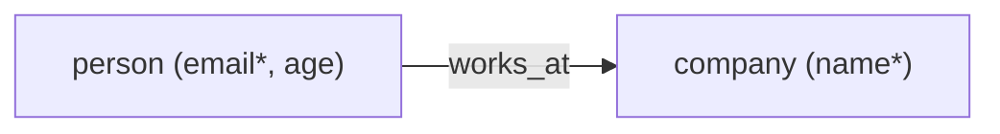

# Graph schema

Declare the *shape* of the graph — which node types exist, which
properties each carries, and which edge kinds connect which node types —
as plain dataclasses. An edge class names its endpoints as fields
annotated with node classes:

```python
from dataclasses import dataclass
from typing import Optional

@dataclass
class Person:
    email: str                  # no default -> required
    age: Optional[int] = None   # optional, may be null

@dataclass
class Company:
    name: str

@dataclass
class WorksAt:
    source: Person              # endpoint, not a property
    target: Company             # endpoint, not a property
    since: int                  # property

graph.define_schema(nodes=[Person, Company], edges=[WorksAt])
```

Pydantic v2 models work anywhere a dataclass does, and the same schema
can be spelled with explicit primitives instead — `NodeType`,
`EdgeType`, `Property` — when there is no class to hand over. All three
inputs normalize to the identical canonical form.

Read it back in whichever representation the consumer speaks:

```python
graph.schema           # canonical dataclasses; None until defined
graph.schema_json      # JSON Schema vocabulary — paste it into a system prompt
graph.schema_networkx  # nx.MultiDiGraph meta-graph (pip install hopai[networkx])
graph.schema_pydantic  # generated pydantic models  (pip install hopai[pydantic])
graph.schema_mermaid   # Mermaid flowchart — paste into a ```mermaid fence
```

`schema_mermaid` needs no dependency at all: GitHub, GitLab and most doc
tooling render the string as a picture. For the schema above it draws:



(`*` marks required, `!` marks unique — the same markers
`tool_summary()` uses, capped with `+N more` on wide types.)

Declaring is in-memory and instant. **Enforcing** is a separate,
explicit step that compiles the schema to CHECK constraints, so the
database itself rejects a person without an email or an `age` of
`"42"` — whichever door the write came through, Cypher and raw SQL
included:

```python
graph.schema_ddl()      # the exact SQL, without running it
graph.enforce_schema()  # idempotent; re-running after a schema change
                        # drops the rules the schema no longer has
graph.add_nodes([{"type": "person"}])   # ConstraintViolation: email required
```

Same SQLAlchemy-metadata attachment as [Constraints](constraints.md)
above: `enforce_schema()`'s CHECK constraints land as real
`CheckConstraint` objects on `graph.nodes_tbl`/`edges_tbl`, visible to
Alembic `--autogenerate` the same way.

Enforcing on a graph that grew **before** the schema did? `ADD
CONSTRAINT` validates every existing row and fails opaquely on the
first bad one. Ask first:

```python
report = graph.schema_violations()   # read-only; falsy when clean
print(report)   # per rule: row counts + sample ids -- the work list
```

Property schemas go further than presence and type: `values=` (or an
`Enum` annotation) enforces an allowed set, `unique=True` compiles to a
*partial* unique index — unique among rows of that type only — nested
dataclasses become nested object schemas, and `datetime`/`date` map to
strings with a JSON Schema format. And with a schema defined, the
Cypher front end can refuse hallucinated vocabulary outright:

```python
graph.cypher("MATCH (a:persn) RETURN a", strict_schema=True)
# CypherError: unknown label 'persn' -- the schema declares: company, person
```

Enforcement covers property presence and JSON type per node type and
edge kind. Endpoint types ("`works_at` connects only person → company")
need a look at the endpoint *nodes*, which a CHECK can't do — so that
one is an explicit opt-in backed by a constraint trigger, priced
per edge write:

```python
graph.enforce_schema(endpoints=True)
graph.add_edges([{"start_id": robot, "end_id": acme, "kind": "works_at"}])
# ConstraintViolation: works_at connects robot -> company,
#                      but the schema declares: works_at: person -> company
```

**Grew the graph first, never declared anything?** The schema is
sitting in the data, and Postgres can compute it:

```python
inferred, report = graph.infer_schema()   # a few GROUP BYs over JSONB
print(report)      # per-type row counts, untyped rows, 42-vs-"42" conflicts

graph.define_schema(schema=inferred)      # adopt it — your call, not automatic
graph.enforce_schema()                    # chaotic graph, now server-validated
```

Inference stays honest: a property on *every* row of its type infers
required, missing-on-some infers optional, an observed null infers
nullable, and a key holding both `42` and `"42"` infers the type set
`["number", "string"]` plus a report entry — never a silently picked
winner. Rows with no `type`/`kind` can't be invented into a type; they
are counted in the report and left alone. An inferred schema is an
**observation** — nothing is registered or enforced until you adopt it,
which is exactly why `infer_schema()` is a method and not a silent
`.schema` fallback.

Inference is a sequential scan. When the graph is too large for one,
`infer_schema(sample_percent=5)` reads a `TABLESAMPLE SYSTEM (5)` slice
instead — counts become estimates, a rare property can be missed, and
`required` means "on every *sampled* row", so the report leads with
`sampled 5% of rows — counts are estimates` rather than letting an
estimate read as truth.

**Sharing the contract.** A schema declared on one handle is invisible
to every other process on the same database. Persist it, and the
database becomes the single source of truth:

```python
graph.save_schema()    # upserts this graph's schema into hopai_schema
                       # (a small metadata table, created on first save)

# ...meanwhile, in another service:
graph = Graph(same_dsn)
graph.load_schema()    # reads it back, validates, ADOPTS it
graph.enforce_schema() # and the contract enforces from the loaded copy
```

Unlike an inferred schema, a loaded one is adopted on the spot — it was
explicitly declared a contract by whoever saved it. The stored document
is `schema_json` verbatim (readable in `psql`), and loading rebuilds it
through the same validation `define_schema()` runs, so a corrupted row
raises loudly instead of half-loading.

